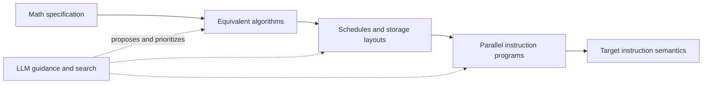

# VeriTac - an ML Compiler concept for the agentic era. (in exploration)

[简体中文](README.zh-CN.md) | **English**

VeriTac explores AI-guided kernel generation with Lean-checked optimization and
lowering, from mathematical definitions to hardware instructions.

The motivating question is: **what if you are the ASIC vendor, and there is no
existing target compiler, IR validator, or reference kernel to rely on?** VeriTac's
goal is to supply that verification layer: every accepted optimization step is
correct under its explicit contract, and its correctness can be automatically
checked by Lean. Successful compilation or numerical agreement alone cannot
establish that guarantee.

Think of an expanding graph of implementations from mathematics to hardware.
LLMs guide its direction, propose transformations and lemmas, and repair failed
attempts using Lean feedback. Enumeration and other search methods explore
alternatives alongside them. Reusable verified tactics are a foundation that the
system can extend, rather than a fixed boundary on what AI may propose. Each
accepted path should carry a composed correctness proof to the target language.

**Current status:** the attention experiments already combine AI-directed kernel
development with enumeration and achieve repeatable vendor-derived speedups.
They have abstract semantic/resource proofs and executable validation, but the
proofs are not yet connected to the generated kernels by a verified lowering
chain. The next milestone is a small, complete path to a minimal target ISA,
including an AI proposal → Lean rejection → repair → verified execution trace.

**Planned: LLM–harness–compiler co-design.** We will develop the model-facing IR
and action interfaces, proof feedback, and search orchestration together. The
harness will combine LLM guidance with enumeration, reuse stable prompt prefixes
and proof context, and turn successful reasoning into reusable tactics. We will
measure time/cost to a complete verified kernel and its performance, while keeping
Lean's acceptance boundary unchanged.

See the [compiler design](veritac_design.md) for the implementation graph,
verification boundaries, mixed search/LLM loop, and planned co-design of the
LLM, harness, and compiler; the [attention design](docs/cuda_attention_design.md) connects this
architecture to the current experiments.

### Headline results

| Target | Workload | Measured speedup | Baseline and metric |
|---|---|---|---|
| **CPU** — gcc-15, 10 threads | GEMM, M=N=K=256 | **12.8×** (18.9 → 1.47 ms) | Untuned generated C → tiled/parallel/vectorized C; execution time |
| **Metal** — Apple M3 Ultra | FP32 causal attention, B1/H8, N2048/D192 | **1.087–1.093×** | Fastest tested MLX/MPSGraph calling path; synchronized wall latency |
| **CUDA** — NVIDIA GB10 | FP32 causal attention, B1/H8, N4096–8192, D192/D256 | **1.12–1.19×** | Fastest successful tested PyTorch SDPA backend; CUDA graph replay time |

The CPU result measures improvement over the untuned generated kernel. The GPU
results are vendor-derived specializations, confirmed in three paired rounds;
their ranges cover the reported shapes and rounds. These are performance results
with Lean-checked transformations and explicit verification boundaries, not yet
a verified end-to-end lowering chain. See the [CPU demo](#end-to-end-gemm-demo)
and [GPU results, raw measurements, and methodology](docs/attention_vendor_results.md).

### End-to-end GEMM demo

`examples/gemm_demo.py` runs the full pipeline on a square matmul:

1. The search agent proposes a schedule (`tile` / `fuse` / `reorder` /
   `parallel` / `vectorize`) and the **Lean CLI re-verifies each tactic**.
2. The schedule is lowered to C. OpenMP pragmas (`#pragma omp parallel for`,
   `#pragma omp simd`) are emitted **only** when a write-dependence check
   (mirroring the proved `indexLocalP_flat_leading` criterion) confirms the
   loop is independent — a reduction loop over `k` correctly gets a comment
   instead of a pragma.
3. The C is compiled with an OpenMP compiler and benchmarked against numpy.

Measured on this machine (gcc-15, 10 threads): the agent's top schedule
(`parallel i0`, `vectorize i2`, `parallel i1`) runs **4.5x** faster at 128³,
and a full register-tiling chain (`tile(32)`×2 → `reorder i1_inner i2` →
`vectorize i1_inner` → `parallel i0_outer`) reaches **12.8x** at 256³
(18.9 ms → 1.47 ms), all matching numpy exactly in those runs. The Lean proofs and codegen guard
support the parallel annotations, but the Python emitter and downstream C
compilation are not a verified lowering chain.

There are two demo entry points:

- `examples/gemm_demo.py [dim]` — offline pipeline: search agent → Lean CLI →
  C → benchmark.
- `examples/llm_gemm_demo.py` — LLM-driven pipeline with full trace output.
  It reads the API key/model from `OPENAI_API_KEY` / `OPENAI_MODEL` /
  `OPENAI_BASE_URL` (or a root `.env`, or interactive prompt); each turn an LLM
  proposes one tactic, the Lean CLI verifies and applies it, and the trace
  prints the proposed tactic, the resulting statement tree, and any rejection
  (which is fed back to the model) — then benchmarks the final schedule.
  `--mock` runs the same trace with a fixed schedule and no API key.

### Attention accelerator survey

The [attention baseline survey](docs/attention_baseline_survey.md) measures
causal prefill attention across NVIDIA GB10/CUDA and Apple M3 Ultra/Metal,
including explicit vendor-backend selection, full-output numerical checks, and
raw timing distributions. It selects FP32 Metal attention at head dimensions
192/256 as the first hardware-aware tactics target, followed by CUDA on GB10.
The benchmark harnesses and reproduction notes live in `benchmarks/attention/`.

### LLM-driven Metal attention demo

`examples/llm_attention_demo.py` runs the attention analogue of the GEMM demo:
an LLM (or a fixed mock) proposes attention-launch refinements — mapping, query
tile, key tile — one tactic at a time. Every proposal is machine-checked by Lean
(`check_attention_tactics`) against a freshly probed, hashed Metal hardware
profile, then the accepted launch is benchmarked against the MLX and MPSGraph
vendor baselines.

Generic mock invocation (no API key needed):

```bash
PYTHONPATH=. python3 examples/llm_attention_demo.py --mock --seq 128 --dim 192 --no-benchmark
```

> **Honest caveat.** The current SIMD candidate kernel is a correctness-first
> *demonstration*. It does not yet beat the vendor baseline.

### LLM-driven Metal tiled-attention plan demo

[examples/llm_tiled_attention_demo.py](examples/llm_tiled_attention_demo.py) is the
tiling-*plan* analogue.  Instead of launch config it refines a **plan**
(`reuse_kv_storage`, `set_query_tile`, `set_key_tile`) one tactic at a time,
machine-checked by Lean (`check_attention_plan`) against a freshly probed, hashed
Metal profile.

A plan carries `alias_kv`. `alias_kv=false` is a *resource-legal planning* state
that stages Q, K and V separately (`Q + K + V`); the installed vendor shader
always aliases K and V into one buffer, so **only `alias_kv=true` is
executable** — the demo never dispatches a non-executable plan. `reuse_kv_storage`
is the verified transformation that turns a planning state into an executable
one (and can only reduce the measured shared-memory bytes:
`Q + max(K,V) ≤ Q + K + V`).

The accepted plan is benchmarked against the **vendor-derived MLX steel
attention small-tile specialization**
([benchmarks/attention/partitioned/steel_attention.py](benchmarks/attention/partitioned/steel_attention.py),
a template-instantiated specialization of the installed `mlx` steel attention
header) and the MLX / MPSGraph vendor baselines, with matching input hashes.

Generic smoke invocation (no benchmark, no API key — it still probes the local
Metal device, so a Metal host is required):

```bash
lake build veritac
python3 examples/llm_tiled_attention_demo.py --mock --no-benchmark
```

Full benchmark (needs `numpy` and `mlx`; probes/compiles on the local GPU):

```bash
python3 examples/llm_tiled_attention_demo.py --mock               # mock schedule
python3 examples/llm_tiled_attention_demo.py --mock --search      # sweep Q8/16/24 x K8/16, fastest correct
```

`--search` enumerates accepted executable candidates through Lean (checking
every intermediate, retaining each candidate's authoritative `checked_plan`,
`tactic_sequence` and `verification_trace`), benchmarks each with
`steel_attention.py` at the exact qt/kt/seq/dim, and keeps the fastest *correct*
(`ok`, finite positive timing) candidate — rejecting any non-executable or
`numeric_failed` result.  The final report then refers to that winner, and the
winner is re-probed, re-checked and freshly replayed for the reported
comparison.  Outputs land in unique `.lake/tiled_attention_demo/run_*`
directories (JSON report + tactic/proof trace), including every candidate
loss/rejection.

On this machine (Apple M3 Ultra, Metal, FP32, batch 1 heads 8) the mock's
**Q16K8, seq 2048, head_dim 192** plan measured wall ≈ **1.906–1.917 ms** across
three rounds vs the fastest vendor baseline ≈ **2.082–2.085 ms**; GPU time ≈
**1.715–1.721 ms** vs MPSGraph ≈ **2.099–2.107 ms**. This is a vendor-derived
specialization for N2048/D192; no claim is made about N1024 or D256.

### LLM-driven CUDA attention demo

[examples/llm_cuda_attention_demo.py](examples/llm_cuda_attention_demo.py) is the
CUDA analogue: the controller runs on a Mac and drives a **remote** CUDA host
over SSH.  It pushes a small remote helper
([examples/cuda_attention_remote.py](examples/cuda_attention_remote.py)) plus a
copy of `Hardware/profile.py` into a unique `controller_runs/<UUID>` directory,
probes the actual CUDA hardware, fetches the compiled `config_info` catalogue,
and feeds an **immutable** normalized target + catalogue into the local Lean
verifier (`check_cuda_attention_plan`).  It then proposes `select_config` tactics
(mock or LLM) one per turn, Lean-checks every one, and benchmarks **only**
authoritative accepted config ids.

Everything the remote helper reports (profile, catalogue, binary/source binding
hashes) is an **observed trust boundary, not a Lean proof**: Lean only checks
resource/partition legality given those observations.  Before any final replay
the demo re-fetches metadata and aborts on drift (profile / catalogue / binding
changed); benchmark results are matched to the checked state by config/seq/dim;
and candidate vs vendor input hashes must be identical.

The candidate is the vendor-derived PyTorch/CUTLASS schedule specialization and
its native `OpMultiplyAddFastF32` (3-component TF32 emulation) — not IEEE scalar
FP32 and not a new precision reduction. Three paired confirmation rounds show
1.12–1.19× CUDA graph speedups at N4096–8192, D192/D256, B1H8. See the
[confirmed results and verification boundaries](docs/attention_vendor_results.md).
Execution additionally requires explicit async drains and disabled V preloading.
Older undrained variants remain visible as planning/diagnostic entries, but the
controller excludes them from execution because of unresolved sanitizer warnings.

Invocation (local controller; the remote CUDA host is reachable over SSH):

```bash
lake build veritac
# metadata + Lean only (no remote benchmark):
python3 examples/llm_cuda_attention_demo.py --mock --no-benchmark
# recommended: sweep the compiled catalogue, benchmark correct configs, fresh replay:
python3 examples/llm_cuda_attention_demo.py --mock --search
OPENAI_API_KEY=sk-... python3 examples/llm_cuda_attention_demo.py   # LLM select_config
# N8192 D256 reference peak exceeds the default 20 GiB survey cap; raise it
# (e.g. 32 GiB on a 128 GB GB10):
python3 examples/llm_cuda_attention_demo.py --mock --seq 8192 --dim 192 --mem-cap-bytes 34359738368
```

Default shape is seq 2048, dim 192, batch 1, heads 8.  `--config-id` forces an
explicit config; mock mode proposes config25 for short sequences and config26
for longer ones when present, starting from the first Lean-legal config.
`--search` enumerates the whole catalogue. Outputs (full results, logs, metadata, report)
land in unique `.lake/cuda_attention_demo/run_*` directories.  Comparisons are
reported event-vs-event and graph-vs-graph separately; unsupported and numerical
failures are losses/failures, never wins.

## Overview

The intended pipeline connects several semantic levels. Each accepted edge has
an equivalence, refinement, or explicit error-bound proof appropriate to its
contract; extraction composes those proofs into an end-to-end argument.



Lean checks proposed transformations and their side conditions. Rejected attempts
stay outside the accepted graph and supply feedback for repair or another branch.
Cost models and measurements guide performance selection; they do not authorize
an unproved step. Hardware instruction semantics are a declared foundation, with
physical hardware conformance and any unverified encoding/lowering boundary
reported explicitly.

The existing semantic IR, scheduled loop IR, tactic library, and demos implement
parts of this architecture. A real-number attention proof does not yet establish
floating-point instruction correctness, and the current C/CUDA/Metal execution
paths still contain unverified connections. These boundaries are the focus of the
next milestone, rather than being hidden behind vendor compiler acceptance.

## Project Structure

```
VeriTac/
├── lakefile.lean                 # Lake build config (Lean 4 + Mathlib)
├── lean-toolchain                # Lean 4.29.0-rc6
├── Main.lean                     # CLI: JSON-in/JSON-out tactic application
├── VeriTac/
│   ├── Basic.lean                # Re-exports all modules
│   ├── IR/
│   │   ├── Shape.lean            # Shape (List Nat), Index (dependent Fin vector)
│   │   ├── TExpr.lean            # Semantic IR: const, tensor, map, zip, reduce
│   │   ├── Denote.lean           # Denotational semantics (TExpr → Index → α)
│   │   └── Operations.lean       # tensorAdd, tensorMap, tensorSum
│   ├── Schedule/
│   │   ├── LoopNest.lean         # Stmt, SExpr, Env, Store, execStmt (fuel-based)
│   │   ├── Equiv.lean            # ScheduleEquiv: ∀ env store, exec s1 = exec s2
│   │   └── Lower.lean            # TExpr → LoopNest (naive nested loops)
│   ├── Tactic/
│   │   ├── Tile.lean             # Split loop into outer/inner
│   │   ├── Split.lean            # Alias for tile
│   │   ├── Fuse.lean             # Merge adjacent loops via div/mod
│   │   ├── Reorder.lean          # Swap independent loops
│   │   ├── Unroll.lean           # Fully unroll constant-bound loops
│   │   ├── Vectorize.lean        # Annotate innermost loop for SIMD
│   │   ├── Parallel.lean         # Annotate loop for parallel execution
│   │   ├── CacheRead.lean        # Insert local buffer + copy + read substitution
│   │   └── Library.lean          # Tactic registry and applyTactic dispatcher
│   ├── Compose/
│   │   ├── Precondition.lean     # Precondition checking per tactic kind
│   │   └── Engine.lean           # applySchedule: sequential tactic composition
│   └── Util/
│       ├── Finset.lean           # Sum partition lemma (for tiling proofs)
│       └── List.lean             # List swap utility
├── CodeGen/                      # Python — unverified C code generator
│   ├── lower.py                  # Parse LoopNest JSON → Python AST
│   ├── emit_c.py                 # Python AST → C code with OpenMP pragmas
│   └── runner.py                 # Compile, run, benchmark against numpy
├── Search/                       # Python — brute-force search agent
│   ├── interface.py              # Lean CLI subprocess wrapper
│   ├── cost_model.py             # Analytical cost model (ops + memory traffic)
│   └── agent.py                  # Enumerate tactic sequences, rank by cost
└── tests/
    └── test_matmul.py            # End-to-end matmul tests
```

## Building

### Prerequisites

- [Lean 4](https://leanprover.github.io/lean4/doc/setup.html) (installed via `elan`)
- Python 3.9+
- `clang` (for C code compilation)
- `numpy` (for benchmark comparisons)

### Build the Lean project

```bash
lake update    # Fetch Mathlib (downloads prebuilt cache, ~5 min first time)
lake build     # Build the library (534 modules)
lake build veritac  # Build the CLI binary
```

### Verify

```bash
# Run the end-to-end matmul (codegen) tests
PYTHONPATH=. python3 tests/test_matmul.py

# Run the soundness regression tests (tile rejection, unroll, annotations)
PYTHONPATH=. python3 tests/test_soundness.py
```

## Usage

### CLI

The `veritac` binary accepts JSON on stdin or via `--json` and applies a sequence of tactics to a loop nest statement.

```bash
# Apply tile(i0, 32) to a simple loop
.lake/build/bin/veritac --json '{
  "stmt": {
    "tag": "loop", "var": "i0",
    "lo": {"tag": "lit", "val": 0},
    "hi": {"tag": "lit", "val": 256},
    "ann": "none",
    "body": {
      "tag": "bufWrite", "buf": "C",
      "indices": [{"tag": "var", "name": "i0"}],
      "val": {"tag": "bufRead", "buf": "A",
              "indices": [{"tag": "var", "name": "i0"}]}
    }
  },
  "tactics": [
    {"kind": "tile", "vars": ["i0"], "int_params": [32]},
    {"kind": "parallel", "vars": ["i0_outer"]}
  ]
}'
```

**Output:**

```json
{
  "applied": 2,
  "stmt": {
    "tag": "loop", "var": "i0_outer", "ann": "parallel",
    "body": {
      "tag": "loop", "var": "i0_inner", "ann": "none",
      "body": { "..." }
    }
  }
}
```

### JSON Format

#### Statements (`Stmt`)

| Tag | Fields | Description |
|-----|--------|-------------|
| `skip` | — | No-op |
| `bufWrite` | `buf`, `indices`, `val` | Write value to buffer |
| `loop` | `var`, `lo`, `hi`, `ann`, `body` | Loop with annotation |
| `seq` | `s1`, `s2` | Sequential composition |
| `alloc` | `buf`, `shape`, `body` | Allocate local buffer |

#### Expressions (`SExpr`)

| Tag | Fields | Description |
|-----|--------|-------------|
| `lit` | `val` (int) | Integer literal |
| `var` | `name` (string) | Variable reference |
| `add`, `mul`, `div`, `mod` | `left`, `right` | Binary arithmetic |
| `bufRead` | `buf`, `indices` | Read from buffer |

#### Annotations

`"none"`, `"parallel"`, `"vectorize"`, `"unrolled"`

#### Tactic Applications

```json
{
  "kind": "<tactic_name>",
  "vars": ["<target_var>", ...],
  "int_params": [<nat>, ...],
  "str_params": ["<string>", ...]
}
```

### Available Tactics

| Tactic | vars | int_params | Description |
|--------|------|------------|-------------|
| `tile` | `[var]` | `[tile_size]` | Split loop into outer/inner |
| `split` | `[var]` | `[factor]` | Alias for tile |
| `fuse` | `[var1, var2]` | — | Merge two adjacent sequential loops |
| `reorder` | `[var1, var2]` | — | Swap two adjacent independent loops |
| `unroll` | `[var]` | — | Fully unroll loop (requires constant bounds) |
| `vectorize` | `[var]` | — | Annotate innermost loop for SIMD |
| `parallel` | `[var]` | — | Annotate loop for parallel execution |
| `cache_read` | — | — | Insert local cache buffer (advanced) |

### Python Code Generation

```python
import json
from CodeGen.lower import parse_stmt
from CodeGen.emit_c import emit_function

# Get optimized loop nest from Lean CLI
result = json.loads(subprocess.check_output([
    ".lake/build/bin/veritac", "--json", json.dumps({
        "stmt": matmul_stmt,
        "tactics": [
            {"kind": "tile", "vars": ["i0"], "int_params": [32]},
            {"kind": "parallel", "vars": ["i0_outer"]}
        ]
    })
]))

# Generate C code
stmt = parse_stmt(result["stmt"])
c_code = emit_function("matmul", stmt,
    input_bufs=[("A", M*K), ("B", K*N)],
    output_bufs=[("C", M*N)])
```

### Search Agent

```bash
# Find optimal tactic sequences for matmul
PYTHONPATH=. python3 -m Search.agent --max-length 3 --top-k 5
```

The agent:
1. Enumerates tactic sequences up to the given length
2. Validates each via the Lean CLI (precondition checking)
3. Scores valid sequences with the analytical cost model
4. Reports top-K results

## Architecture

### Two-Level IR

**Semantic IR (`TExpr`)** describes *what* to compute:
- Parameterized over `α` (any type) — proven for all types, tested with `Nat`/`Int`
- `denote : TExpr α s → (Index s → α)` gives mathematical meaning
- Proven lemma: `denote (map g (map f e)) = denote (map (g ∘ f) e)`

**Scheduled IR (`Stmt`/`SExpr`)** describes *how* to compute it:
- Loop nests with explicit iteration, buffer reads/writes
- Annotations for parallelism and vectorization
- `execStmt` with fuel-based semantics for termination

### Correctness

Each tactic has a correctness theorem of the form:

```
theorem tactic_correct : original_stmt ≈ₛ transformed_stmt
```

where `s1 ≈ₛ s2` means `∀ fuel env store, execStmt fuel env store s1 = execStmt fuel env store s2`.

Composition correctness follows from transitivity:

```lean
theorem ScheduleEquiv.trans : s1 ≈ₛ s2 → s2 ≈ₛ s3 → s1 ≈ₛ s3
```

### Proof Status

The verification framework is set up, and several core correctness theorems now
carry machine-checked proofs (no `sorry`). The following are **proven**:

| Theorem | Status | Notes |
|---------|--------|-------|
| `vectorize_correct`, `parallel_correct` | ✅ proven | `execStmt` discards loop annotations, so these are syntactic no-ops in the model |
| `substExprVar_eval` | ✅ proven | expression-level substitution (`v ↦ e` evaluates under `env[v := e]`) |
| `substStmtVar_lit_correct` | ✅ proven | statement-level substitution for a *literal* `v ↦ lit k` |
| `unroll_correct` | ✅ proven | via `unrollBody_correct`, which connects `execLoopIters` to the unrolled statement |
| `tile_correct` | ✅ proven | via `execLoopIters_partition` + `substStmtVar_correct` |
| `fuse_correct` | ✅ proven | via `execLoopIters_fuse` + `substStmtVar_correct` |
| `reorder_correct` | ✅ proven | restated with a semantic commutation hypothesis |
| `cacheRead_correct` | ✅ proven | restated: read substitution is a no-op from a mirroring store |
| `split_correct` | ✅ proven | reduces to `tile_correct` |

All tactic correctness theorems now carry **machine-checked proofs with zero
`sorry`**. The proof infrastructure lives in `VeriTac/Schedule/`:

| Infrastructure | What it provides |
|----------------|------------------|
| `LoopComposition.lean` | Function-level Kleisli composition (`kcomp`), block *partition* (tile), *swap* (reorder), *fusion* (fuse), interleave/commutation, and general substitution lemmas over `execLoopIters` |
| `FreeVars.lean` | `varFreeStmt` (bounds-sensitive capture analysis), `exprStatic`, read-only / read-set predicates |
| `ExecLemmas.lean` | Totality of the interpreter, store-invariance under unused bindings, read-only and write-set discipline, "agreement off a buffer" (blind) lemmas |

The proofs themselves:

- **`tile_correct`** — via `execLoopIters_partition` + the general statement
  substitution lemma `substStmtVar_correct` (hypotheses: `loopBinds v body = false`,
  the generated `_outer` / `_inner` names are fresh, and the tile size divides the
  loop extent). The `tileAt` outer bound is now the *exact quotient* `hi/ts`.
- **`fuse_correct`** — via `execLoopIters_fuse`, using the `(i, j) ↔ i*M + j`
  bijection with the required `0 ≤ j < M` range, plus a double application of
  `substStmtVar_correct` (the fused name must be fresh for the body).
- **`reorder_correct`** — restated honestly: it requires `v1 ≠ v2`, bounds that are
  independent of the other axis (`varInExpr`/`exprStatic`-free) *and* a semantic
  pairwise-commutation hypothesis on the body. The Lean theorem encodes exactly why
  `loopsIndependent` is only a syntactic heuristic; discharging the commutation
  hypothesis for a concrete body is the dependence-analysis obligation.
- **`cacheRead_correct`** — restated honestly: substituting `origBuf ↦ cacheBuf`
  reads is a no-op when the cache mirrors the source in the starting store and both
  buffers are read-only for the statement (`isReadOnly`). The *copy loops* inserted
  by `cacheRead` must establish that mirror, which is the remaining (Python-side)
  obligation.
- **parallel dependence bridge** — `indexLocalP_flat_leading` proves that when
  every write index of a loop body is *local to* the axis variable (bare `v` as
  the leading index, the rest `v`-free and store-independent), different axis
  values write disjoint flat cells, so iterations are pairwise independent. This
  is the sound dependence criterion (`loopLocalWritesP`) behind a `parallel`
  annotation; the syntactic `checkIndependence` remains the search-side heuristic.
- **`split_correct`** — reduces to `tile_correct` (same theorem, now proved).

#### Soundness fixes made

While auditing the semantics, several genuine soundness bugs were found and fixed:

1. **Fuel was consumed per loop-nesting level.** `execStmt` decremented fuel when
   entering a loop body, so restructuring a nest (tiling adds a level) starved the
   leaf computation, making `tile_correct`'s `∀ fuel` statement false. Fuel is now
   carried but not consumed: each loop has a finite iteration count, so the
   interpreter is total and tiling cannot change the budget leaves receive.
2. **`tile` overran the range when the tile size didn't divide the extent.** The
   inner loop's upper bound was hard-coded to `tileSize`, so the final block
   iterated past `hi` when `hi % tileSize ≠ 0`. `tile` now requires a literal
   `[0, hiVal)` range with `hiVal % tileSize = 0` and refuses otherwise.
3. **`fuse` was applied to sequential loops using a div/mod split**, which ran the
   second body `N₁ * N₂` times. It now fuses *nested* loops correctly.

> **Note on annotations.** `execStmt` ignores loop annotations, so `parallel` and
> `vectorize` are trivially "correct" in the Lean model. The *actual* correctness of
> the generated parallel/SIMD code still requires a genuine dependence analysis for
> the annotation to be safe (`parallel` on a loop with loop-carried dependencies
> would produce incorrect `#pragma omp parallel` code). The Lean proofs establish
> semantic equivalence of the loop nest; the code-generation-level dependence
> property is a separate, open obligation.

## Design Decisions

1. **Numeric abstraction**: IR parameterized over any type; float semantics deferred
2. **Shapes as `List Nat`**: Avoids heavy dependent-type plumbing
3. **Fuel carried but not consumed**: Loop bounds are finite, so the interpreter is
   total. Fuel is kept in the signature but never reduces, which is what makes the
   loop-restructuring equivalence theorems provable for every `fuel` value.
4. **Lean-Python interface**: JSON over subprocess (no FFI needed)
5. **Flat indexing with stride 1000**: Both Lean execution and C codegen use the same convention for correctness alignment
6. **Selective Mathlib use**: `Finset`, `Fin`, `omega` — prebuilt cache for fast builds

## License

MIT
