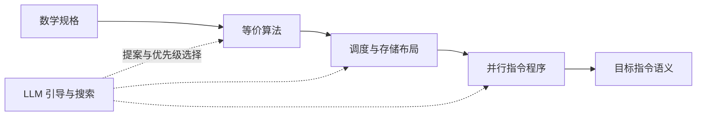

# VeriTac —— 面向智能体时代的 ML 编译器概念（探索阶段）

[English](README.md) | **简体中文**

VeriTac 探索由 AI 引导的内核生成：从数学定义出发，经由 Lean 检查优化与逐层降级，最终到达硬件指令。

核心问题是：**如果你自己就是 ASIC 厂商，没有现成的目标编译器、IR 验证器或参考内核可以依赖，该怎么办？** VeriTac 的目标是提供这一验证层：每个被接受的优化步骤都在明确的契约下保持正确，其正确性可以由 Lean 自动检查。仅仅编译成功或数值测试一致，无法建立这样的保证。

可以把它想象成一张从数学延伸到硬件、不断扩展的实现图。LLM 引导探索方向，提出变换与引理，并根据 Lean 的反馈修复失败的尝试；枚举及其他搜索方法则共同探索备选实现。可复用的已验证策略（tactic）是可以持续扩展的基础，而不是限制 AI 提案的固定边界。每条被接受的完整路径，都应携带一份组合而成、直达目标语言的正确性证明。

**当前状态：** 注意力实验已经结合了 AI 指导的内核开发与枚举搜索，并在基于厂商内核的特化实现上取得了可重复的加速。已有抽象语义／资源证明和可执行实现的验证，但抽象证明与生成的内核之间，尚未由一条经过验证的降级链连接起来。下一个里程碑是建立一条通往最小目标 ISA 的完整路径，展示「AI 提案 → Lean 拒绝 → 修复 → 经验证的执行」全过程。

**规划方向：LLM–harness–compiler 协同设计。** 我们将联合设计面向模型的 IR 与操作接口、证明反馈，以及搜索编排框架（harness）。框架将结合 LLM 引导与枚举搜索，复用稳定的提示词前缀和证明上下文，并把成功的推理沉淀为可复用策略。评估重点是获得完整已验证内核所需的时间与成本，以及内核性能；Lean 的接受标准保持不变。

[编译器设计](veritac_design.md)介绍了实现图、验证边界、搜索与 LLM 协同的反馈循环，以及拟议中的 LLM、编排框架与编译器协同设计；[注意力设计](docs/cuda_attention_design.md)则说明这套架构与当前实验的关系。

### 主要性能结果

| 目标 | 工作负载 | 实测加速比 | 基线与计时指标 |
|---|---|---|---|
| **CPU** — gcc-15，10 线程 | GEMM，M=N=K=256 | **12.8×**（18.9 → 1.47 ms） | 未调优的生成 C 内核 → 分块／并行／向量化后的 C 内核；执行时间 |
| **Metal** — Apple M3 Ultra | FP32 因果注意力，B1/H8，N2048/D192 | **1.087–1.093×** | 实测 MLX／MPSGraph 中最快的调用路径；同步墙钟延迟 |
| **CUDA** — NVIDIA GB10 | FP32 因果注意力，B1/H8，N4096–8192，D192/D256 | **1.12–1.19×** | 实测成功运行的 PyTorch SDPA 后端中最快者；CUDA Graph 重放时间 |

CPU 结果衡量相对于未调优生成内核的提升。GPU 结果来自基于厂商内核的特化实现，经过三轮配对实验确认；表中的范围覆盖所报告的形状与轮次。这些结果具有 Lean 检查的变换和明确的验证边界，但尚不代表一条经过验证的端到端降级链。详见 [CPU 演示](#端到端-gemm-演示)及 [GPU 结果、原始测量与实验方法](docs/attention_vendor_results.md)。

### 端到端 GEMM 演示

`examples/gemm_demo.py` 在一个方阵矩阵乘法上跑完整流水线：

1. 搜索智能体提出调度方案（`tile` / `fuse` / `reorder` / `parallel` / `vectorize`），**Lean CLI 对每个策略重新验证**。
2. 调度被降级为 C 代码。OpenMP 编译指示（`#pragma omp parallel for`、`#pragma omp simd`）**仅当**写依赖检查（镜像已证明的 `indexLocalP_flat_leading` 判据）确认循环相互独立时才生成——对 `k` 的归约循环会正确地得到注释而非编译指示。
3. C 代码用支持 OpenMP 的编译器编译，并与 numpy 对比基准测试。

在本机实测（gcc-15，10 线程）：智能体的最佳调度（`parallel i0`、`vectorize i2`、`parallel i1`）在 128³ 下达到 **4.5x** 加速；完整寄存器分块链（`tile(32)`×2 → `reorder i1_inner i2` → `vectorize i1_inner` → `parallel i0_outer`）在 256³ 下达到 **12.8x**（18.9 ms → 1.47 ms），这些运行中的结果均与 numpy 完全一致。Lean 证明与代码生成层的检查为并行标注提供了依据，但 Python 代码生成器与后续 C 编译尚未构成一条经过验证的降级链。

有两个演示入口：

- `examples/gemm_demo.py [dim]` —— 离线流水线：搜索智能体 → Lean CLI → C → 基准测试。
- `examples/llm_gemm_demo.py` —— 带完整轨迹输出的 LLM 驱动流水线。从 `OPENAI_API_KEY` / `OPENAI_MODEL` / `OPENAI_BASE_URL`（或根目录 `.env`，或交互式提示）读取 API 密钥与模型；每一轮由一个 LLM 提出一个策略，Lean CLI 验证并应用之，轨迹打印所提出的策略、结果语句树以及任何被拒绝的信息（并作为反馈回传给模型），最后对最终调度做基准测试。`--mock` 用固定调度运行同一轨迹，无需 API 密钥。

### 注意力加速器基线调查

[注意力基线调查](docs/attention_baseline_survey.md)在 NVIDIA GB10／CUDA 和 Apple M3 Ultra／Metal 上测量因果预填充注意力，包含显式选择厂商后端、完整输出的数值检查，以及原始计时分布。调查选定头维度 192／256 的 FP32 Metal 注意力作为首个硬件感知策略目标，随后扩展到 GB10 上的 CUDA。基准工具与复现说明位于 `benchmarks/attention/`。

### LLM 驱动的 Metal 注意力演示

`examples/llm_attention_demo.py` 是 GEMM 演示的注意力版本：LLM（或固定 mock）每轮提出一个注意力启动配置变换，包括映射方式、查询分块和键分块。Lean 通过 `check_attention_tactics`，依据刚刚探测并计算哈希的 Metal 硬件描述检查提案，然后将被接受的配置与 MLX、MPSGraph 厂商基线进行性能对比。

无需 API 密钥的 mock 调用：

```bash
PYTHONPATH=. python3 examples/llm_attention_demo.py --mock --seq 128 --dim 192 --no-benchmark
```

> 当前 SIMD 候选内核用于演示正确性验证，尚未超过厂商基线。下方分块计划演示使用的是另一套特化实现。

### LLM 驱动的 Metal 分块注意力计划演示

[examples/llm_tiled_attention_demo.py](examples/llm_tiled_attention_demo.py)逐步优化的是分块**计划**。每轮提出 `reuse_kv_storage`、`set_query_tile` 或 `set_key_tile`，Lean 通过 `check_attention_plan`，依据新探测并计算哈希的 Metal 硬件描述检查每一步。

计划包含 `alias_kv` 字段。`alias_kv=false` 是资源合法的规划状态，分别暂存 Q、K、V，所需空间为 `Q + K + V`。当前使用的厂商着色器始终让 K、V 复用同一缓冲区，因此**只有 `alias_kv=true` 才能执行**；演示不会派发不可执行的计划。`reuse_kv_storage` 将规划状态变为可执行状态，其存储需求不会增加：`Q + max(K,V) ≤ Q + K + V`。

被接受的计划通过[基于厂商 MLX steel 注意力模板的小分块特化实现](benchmarks/attention/partitioned/steel_attention.py)执行，并与 MLX／MPSGraph 基线进行对比。该实现实例化已安装 `mlx` 包的 steel 注意力模板；候选与基线使用哈希一致的输入。

冒烟检查不做性能测量，也不需要 API 密钥，但仍会探测本地 Metal 设备，因此需要支持 Metal 的主机：

```bash
lake build veritac
python3 examples/llm_tiled_attention_demo.py --mock --no-benchmark
```

完整基准测试需要 `numpy`、`mlx`，并在本地 GPU 上探测、编译和运行：

```bash
python3 examples/llm_tiled_attention_demo.py --mock               # 固定 mock 调度
python3 examples/llm_tiled_attention_demo.py --mock --search      # 枚举 Q8/16/24 × K8/16，选择最快的正确候选
```

`--search` 通过 Lean 检查每个中间状态，为候选保留权威的 `checked_plan`、`tactic_sequence` 和 `verification_trace`，再以完全一致的 qt／kt／seq／dim 调用 `steel_attention.py`。只有状态为 `ok`、计时有限且为正的正确候选才能胜出；不可执行或 `numeric_failed` 的结果会被排除。最终报告绑定到胜出候选，并重新探测硬件、检查计划和运行候选后报告对比结果。JSON 报告、策略／证明轨迹和所有失败或被拒绝的候选，都保存在唯一的 `.lake/tiled_attention_demo/run_*` 目录中。

在本机 Apple M3 Ultra 上，以 FP32、batch 1、8 个头运行时，**Q16K8、N2048、D192** 计划在三轮测量中的墙钟延迟约为 **1.906–1.917 ms**，最快厂商基线约为 **2.082–2.085 ms**；候选 GPU 时间约为 **1.715–1.721 ms**，MPSGraph 约为 **2.099–2.107 ms**。这一结论针对基于厂商模板的 N2048／D192 特化实现，不延伸到 N1024 或 D256。

### LLM 驱动的 CUDA 注意力演示

[examples/llm_cuda_attention_demo.py](examples/llm_cuda_attention_demo.py)是 CUDA 版本：控制器在 Mac 上运行，通过 SSH 驱动远程 CUDA 主机。它将[远程辅助脚本](examples/cuda_attention_remote.py)和 `Hardware/profile.py` 的副本上传到唯一的 `controller_runs/<UUID>` 目录，探测真实硬件、获取编译后的 `config_info` 配置目录，并将不可变的规范化硬件描述与配置目录交给本地 Lean 验证器（`check_cuda_attention_plan`）。随后由 mock 或 LLM 每轮提出一个 `select_config` 策略，经 Lean 检查后，仅按验证结果中的权威配置 ID 运行候选。

远程脚本报告的硬件描述、配置目录及二进制／源代码绑定哈希，是**观测所得的信任边界，而不是 Lean 证明**。Lean 在这些观测成立的条件下检查资源与划分合法性。最终重放前，演示会重新读取元数据；硬件描述、配置目录或绑定发生变化就中止。测量结果须与检查过的配置、序列长度和头维度匹配，候选与厂商输入的哈希也必须完全一致。

候选基于 PyTorch／CUTLASS 厂商内核进行调度特化，保留原生 `OpMultiplyAddFastF32` 的三分量 TF32 模拟运算；它不是标量 IEEE FP32 运算，也没有新引入输入精度降低。三轮配对实验在 B1H8、N4096–8192、D192／D256 上确认了 **1.12–1.19×** 的 CUDA Graph 加速，详见[结果与验证边界](docs/attention_vendor_results.md)。执行还要求显式等待异步拷贝完成，并禁用 V 预加载。旧的、未显式排空异步拷贝的版本仍保留为规划／诊断条目，但因尚未解决的 sanitizer 警告，控制器不会派发它们。

在本地控制器上调用，远程 CUDA 主机须可通过 SSH 访问：

```bash
lake build veritac
# 仅获取元数据并运行 Lean 检查，不在远程测量性能：
python3 examples/llm_cuda_attention_demo.py --mock --no-benchmark
# 枚举编译后的配置目录，测量正确候选并重新运行胜出配置：
python3 examples/llm_cuda_attention_demo.py --mock --search
OPENAI_API_KEY=sk-... python3 examples/llm_cuda_attention_demo.py   # LLM 提出 select_config
# N8192 的参考计算会超过默认 20 GiB 调查内存上限；
# 在 128 GB 的 GB10 上可将上限提高到 32 GiB：
python3 examples/llm_cuda_attention_demo.py --mock --seq 8192 --dim 192 --mem-cap-bytes 34359738368
```

默认形状为序列长度 2048、头维度 192、batch 1、8 个头。`--config-id` 指定配置；否则 mock 从第一个通过 Lean 检查的配置出发，在目录中存在相应条目时，为短序列提出 config25，为长序列提出 config26。`--search` 枚举整个配置目录。完整结果、日志、元数据和报告保存在唯一的 `.lake/cuda_attention_demo/run_*` 目录中。CUDA event 与 event、graph 与 graph 分别比较；不支持的后端和数值失败不会被算作胜利。

## 总览

目标流水线连接多个语义层级。每条被接受的边都携带符合其契约的等价证明、精化证明或显式误差界证明；提取实现路径时，将这些证明组合成端到端的正确性论证。



Lean 检查提议的变换及其附加条件。被拒绝的尝试留在已接受图之外，为修复或探索其他分支提供反馈。成本模型与测量用于选择性能更好的实现，不能授权未经证明的步骤。硬件指令语义是明确声明的基础；物理硬件与模型是否一致，以及任何尚未验证的编码／降级边界，都必须明确报告。

现有语义 IR、调度循环 IR、策略库和演示实现了这套架构的一部分。实数域上的注意力证明尚不能建立浮点指令的正确性，当前 C／CUDA／Metal 执行路径也仍有未经验证的连接。这些边界是下一个里程碑的重点，不能用厂商编译器接受代码来代替证明。

## 项目结构

```
VeriTac/
├── lakefile.lean                 # Lake 构建配置（Lean 4 + Mathlib）
├── lean-toolchain                # Lean 4.29.0-rc6
├── Main.lean                     # CLI：JSON 进 / JSON 出的策略应用
├── VeriTac/
│   ├── Basic.lean                # 再导出所有模块
│   ├── IR/
│   │   ├── Shape.lean            # Shape（List Nat）、Index（依赖类型 Fin 向量）
│   │   ├── TExpr.lean            # 语义 IR：const、tensor、map、zip、reduce
│   │   ├── Denote.lean           # 指称语义（TExpr → Index → α）
│   │   └── Operations.lean       # tensorAdd、tensorMap、tensorSum
│   ├── Schedule/
│   │   ├── LoopNest.lean         # Stmt、SExpr、Env、Store、execStmt（基于 fuel）
│   │   ├── Equiv.lean            # ScheduleEquiv：∀ env store, exec s1 = exec s2
│   │   └── Lower.lean            # TExpr → LoopNest（朴素嵌套循环）
│   ├── Tactic/
│   │   ├── Tile.lean             # 把循环拆成 outer/inner 两层
│   │   ├── Split.lean            # tile 的别名
│   │   ├── Fuse.lean             # 通过 div/mod 合并相邻循环
│   │   ├── Reorder.lean          # 交换相互独立的循环
│   │   ├── Unroll.lean           # 完全展开常量边界的循环
│   │   ├── Vectorize.lean        # 给最内层循环标注 SIMD
│   │   ├── Parallel.lean         # 给循环标注并行执行
│   │   ├── CacheRead.lean        # 插入本地缓冲 + 拷贝 + 读取替换
│   │   └── Library.lean          # 策略注册表与 applyTactic 分发器
│   ├── Compose/
│   │   ├── Precondition.lean     # 按策略种类做前置条件检查
│   │   └── Engine.lean           # applySchedule：顺序策略组合
│   └── Util/
│       ├── Finset.lean           # 求和划分引理（用于 tiling 证明）
│       └── List.lean             # List 交换工具
├── CodeGen/                      # Python —— 未被验证的 C 代码生成器
│   ├── lower.py                  # 解析 LoopNest JSON → Python AST
│   ├── emit_c.py                 # Python AST → 带 OpenMP 编译指示的 C 代码
│   └── runner.py                 # 编译、运行、与 numpy 基准对比
├── Search/                       # Python —— 暴力搜索智能体
│   ├── interface.py              # Lean CLI 子进程封装
│   ├── cost_model.py             # 解析式成本模型（运算 + 内存流量）
│   └── agent.py                  # 枚举策略序列，按成本排序
└── tests/
    └── test_matmul.py            # 端到端矩阵乘法测试
```

## 构建

### 前置依赖

- [Lean 4](https://leanprover.github.io/lean4/doc/setup.html)（通过 `elan` 安装）
- Python 3.9+
- `clang`（用于编译 C 代码）
- `numpy`（用于基准对比）

### 构建 Lean 工程

```bash
lake update    # 获取 Mathlib（首次会下载预构建缓存，约 5 分钟）
lake build     # 构建库（534 个模块）
lake build veritac  # 构建 CLI 二进制
```

### 验证

```bash
# 运行端到端 matmul（代码生成）测试
PYTHONPATH=. python3 tests/test_matmul.py

# 运行健全性回归测试（tile 拒绝、unroll、标注）
PYTHONPATH=. python3 tests/test_soundness.py
```

## 使用

### CLI

`veritac` 二进制从 stdin 或 `--json` 读取 JSON，对一个循环嵌套语句应用一系列策略。

```bash
# 对简单循环应用 tile(i0, 32)
.lake/build/bin/veritac --json '{
  "stmt": {
    "tag": "loop", "var": "i0",
    "lo": {"tag": "lit", "val": 0},
    "hi": {"tag": "lit", "val": 256},
    "ann": "none",
    "body": {
      "tag": "bufWrite", "buf": "C",
      "indices": [{"tag": "var", "name": "i0"}],
      "val": {"tag": "bufRead", "buf": "A",
              "indices": [{"tag": "var", "name": "i0"}]}
    }
  },
  "tactics": [
    {"kind": "tile", "vars": ["i0"], "int_params": [32]},
    {"kind": "parallel", "vars": ["i0_outer"]}
  ]
}'
```

**输出：**

```json
{
  "applied": 2,
  "stmt": {
    "tag": "loop", "var": "i0_outer", "ann": "parallel",
    "body": {
      "tag": "loop", "var": "i0_inner", "ann": "none",
      "body": { "..." }
    }
  }
}
```

### JSON 格式

#### 语句（`Stmt`）

| Tag | 字段 | 说明 |
|-----|--------|-------------|
| `skip` | — | 空操作 |
| `bufWrite` | `buf`、`indices`、`val` | 向缓冲写入值 |
| `loop` | `var`、`lo`、`hi`、`ann`、`body` | 带标注的循环 |
| `seq` | `s1`、`s2` | 顺序组合 |
| `alloc` | `buf`、`shape`、`body` | 分配本地缓冲 |

#### 表达式（`SExpr`）

| Tag | 字段 | 说明 |
|-----|--------|-------------|
| `lit` | `val`（int） | 整数字面量 |
| `var` | `name`（string） | 变量引用 |
| `add`、`mul`、`div`、`mod` | `left`、`right` | 二元算术 |
| `bufRead` | `buf`、`indices` | 从缓冲读取 |

#### 标注

`"none"`、`"parallel"`、`"vectorize"`、`"unrolled"`

#### 策略应用

```json
{
  "kind": "<tactic_name>",
  "vars": ["<target_var>", ...],
  "int_params": [<nat>, ...],
  "str_params": ["<string>", ...]
}
```

### 可用策略

| 策略 | vars | int_params | 说明 |
|--------|------|------------|-------------|
| `tile` | `[var]` | `[tile_size]` | 把循环拆成 outer/inner |
| `split` | `[var]` | `[factor]` | tile 的别名 |
| `fuse` | `[var1, var2]` | — | 合并两个相邻的顺序循环 |
| `reorder` | `[var1, var2]` | — | 交换两个相邻的独立循环 |
| `unroll` | `[var]` | — | 完全展开循环（要求常量边界） |
| `vectorize` | `[var]` | — | 给最内层循环标注 SIMD |
| `parallel` | `[var]` | — | 给循环标注并行执行 |
| `cache_read` | — | — | 插入本地缓存缓冲（进阶） |

### Python 代码生成

```python
import json
from CodeGen.lower import parse_stmt
from CodeGen.emit_c import emit_function

# 从 Lean CLI 获取优化后的循环嵌套
result = json.loads(subprocess.check_output([
    ".lake/build/bin/veritac", "--json", json.dumps({
        "stmt": matmul_stmt,
        "tactics": [
            {"kind": "tile", "vars": ["i0"], "int_params": [32]},
            {"kind": "parallel", "vars": ["i0_outer"]}
        ]
    })
]))

# 生成 C 代码
stmt = parse_stmt(result["stmt"])
c_code = emit_function("matmul", stmt,
    input_bufs=[("A", M*K), ("B", K*N)],
    output_bufs=[("C", M*N)])
```

### 搜索智能体

```bash
# 为 matmul 寻找最优策略序列
PYTHONPATH=. python3 -m Search.agent --max-length 3 --top-k 5
```

该智能体的工作流程：

1. 枚举给定长度以内的策略序列
2. 通过 Lean CLI 验证每一个（前置条件检查）
3. 用解析式成本模型为有效序列打分
4. 输出 Top-K 结果

## 架构

### 双层 IR

**语义 IR（`TExpr`）**描述**算什么**：

- 以 `α`（任意类型）为参数——对所有类型都成立，用 `Nat`/`Int` 测试
- `denote : TExpr α s → (Index s → α)` 给出数学含义
- 已证明引理：`denote (map g (map f e)) = denote (map (g ∘ f) e)`

**调度 IR（`Stmt`/`SExpr`）**描述**怎么算**：

- 带显式迭代、缓冲读写与标注的循环嵌套
- 用于并行与向量化的标注
- 基于 fuel 的 `execStmt` 语义以保证可终止性

### 正确性

每个策略都有一个形如下的正确性定理：

```
theorem tactic_correct : original_stmt ≈ₛ transformed_stmt
```

其中 `s1 ≈ₛ s2` 表示 `∀ fuel env store, execStmt fuel env store s1 = execStmt fuel env store s2`。

组合正确性由传递性导出：

```lean
theorem ScheduleEquiv.trans : s1 ≈ₛ s2 → s2 ≈ₛ s3 → s1 ≈ₛ s3
```

### 证明状态

验证框架已搭建完成，几个核心正确性定理现已在机器上校验通过（无 `sorry`）。以下是**已证明**的：

| 定理 | 状态 | 说明 |
|---------|--------|-------|
| `vectorize_correct`、`parallel_correct` | ✅ 已证明 | `execStmt` 忽略循环标注，因此在模型中它们是语法层面的空操作 |
| `substExprVar_eval` | ✅ 已证明 | 表达式级替换（`v ↦ e` 在 `env[v := e]` 下求值） |
| `substStmtVar_lit_correct` | ✅ 已证明 | 对**字面量** `v ↦ lit k` 的语句级替换 |
| `unroll_correct` | ✅ 已证明 | 通过 `unrollBody_correct`，把 `execLoopIters` 与展开后的语句联系起来 |
| `tile_correct` | ✅ 已证明 | 通过 `execLoopIters_partition` + `substStmtVar_correct` |
| `fuse_correct` | ✅ 已证明 | 通过 `execLoopIters_fuse` + `substStmtVar_correct` |
| `reorder_correct` | ✅ 已证明 | 以语义交换假设重述 |
| `cacheRead_correct` | ✅ 已证明 | 重述：从镜像 store 中读取替换是空操作 |
| `split_correct` | ✅ 已证明 | 归结为 `tile_correct` |

所有策略正确性定理现在都带有**零 `sorry` 的机器校验证明**。证明基础设施位于 `VeriTac/Schedule/`：

| 基础设施 | 提供什么 |
|----------------|------------------|
| `LoopComposition.lean` | 函数级 Kleisli 组合（`kcomp`）、块**划分**（tile）、**交换**（reorder）、**合并**（fuse），以及关于 `execLoopIters` 的交错/交换与一般替换引理 |
| `FreeVars.lean` | `varFreeStmt`（考虑边界的捕获分析）、`exprStatic`、只读/读集谓词 |
| `ExecLemmas.lean` | 解释器的总体性、在未使用绑定下 store 的不变性、只读与写集纪律、「脱离缓冲达成一致」（blind）引理 |

证明本身：

- **`tile_correct`** —— 通过 `execLoopIters_partition` + 一般语句替换引理 `substStmtVar_correct`（假设：`loopBinds v body = false`、生成的 `_outer`/`_inner` 名字是新的、且 tile 大小整除循环范围）。`tileAt` 的外层上界现在是精确商 `hi/ts`。
- **`fuse_correct`** —— 通过 `execLoopIters_fuse`，使用 `(i, j) ↔ i*M + j` 双射并满足 `0 ≤ j < M`，以及两次应用 `substStmtVar_correct`（合并后的名字必须对 body 是新的）。
- **`reorder_correct`** —— 诚实地重述：它要求 `v1 ≠ v2`、边界与另一轴无关（`varInExpr`/`exprStatic` 无关）**并且**对 body 存在语义上的两两交换假设。Lean 定理精确编码了为什么 `loopsIndependent` 只是语法启发式；为具体 body 完成交换假设的证明是依赖分析的责任。
- **`cacheRead_correct`** —— 诚实地重述：当缓存缓冲在起始 store 中镜像了源缓冲、且两个缓冲对语句都是只读（`isReadOnly`）时，把 `origBuf ↦ cacheBuf` 的读取替换是空操作。`cacheRead` 插入的*拷贝循环*必须建立这种镜像关系，这是（Python 侧的）剩余责任。
- **并行依赖桥接** —— `indexLocalP_flat_leading` 证明：当循环体每个写索引对该轴变量都是*局部的*（以裸 `v` 作为领头的索引，其余部分与 `v` 无关且与 store 无关）时，不同的轴值写入不相交的扁平单元，因此各迭代是两两独立的。这是 `parallel` 标注背后健全的依赖判据（`loopLocalWritesP`）；语法上的 `checkIndependence` 仍是搜索侧的启发式。
- **`split_correct`** —— 归结为 `tile_correct`（同一定理，现已证明）。

#### 所做的健全性修复

在审计语义时发现并修复了若干真正的健全性缺陷：

1. **fuel 在每个循环嵌套层都被消耗。** `execStmt` 在进入循环体时会递减 fuel，导致重构嵌套（分块会加一层）会耗尽叶计算的预算，使 `tile_correct` 的 `∀ fuel` 陈述为假。现在 fuel 被携带但不再消耗：每个循环都有有限的迭代次数，因此解释器是整体的，分块也不会改变叶层获得的预算。
2. **当 tile 大小不能整除范围时 `tile` 会越界。** 内层循环上界被硬编码为 `tileSize`，导致当 `hi % tileSize ≠ 0` 时最后一个块迭代越过了 `hi`。现在 `tile` 要求字面量 `[0, hiVal)` 范围且 `hiVal % tileSize = 0`，否则拒绝。
3. **`fuse` 用 div/mod 拆分对顺序循环做合并**，这会把第二个 body 运行 `N₁ * N₂` 次。现在正确地合并*嵌套*循环。

> **关于标注的说明。** `execStmt` 忽略循环标注，因此 `parallel` 与 `vectorize` 在 Lean 模型中是平凡地「正确」的。生成代码中并行/SIMD 的*真正*正确性仍需对标注做真实的依赖分析（在带循环携带依赖的循环上做 `parallel` 会生成错误的 `#pragma omp parallel` 代码）。Lean 证明建立了循环嵌套的语义等价；代码生成层的依赖属性是另一项待完成的责任。

## 设计决策

1. **数值抽象**：IR 以任意类型为参数；浮点语义推迟。
2. **Shape 用 `List Nat`**：避免繁重的依赖类型管道。
3. **fuel 携带但不消耗**：循环边界有限，解释器是整体的。fuel 保留在签名中但从不减少，这使得循环重构等价定理可以对任意 `fuel` 值证明。
4. **Lean-Python 接口**：通过子进程走 JSON（无需 FFI）。
5. **步长 1000 的扁平索引**：Lean 执行与 C 代码生成使用相同的约定以保证正确性对齐。
6. **选择性使用 Mathlib**：`Finset`、`Fin`、`omega` —— 预构建缓存，加快构建。

## 许可证

MIT
