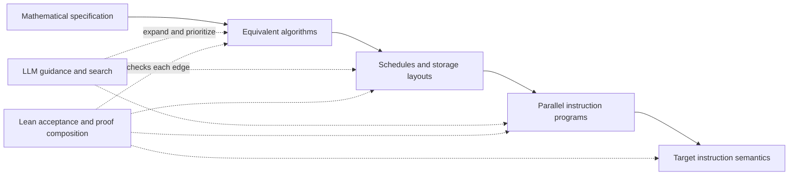

# Verified Tactic-Based ML Compiler: Design Plan

## 1. Executive Summary

VeriTac aims to generate efficient kernels from a mathematical specification and
formal hardware/instruction semantics, with every accepted optimization and
lowering step automatically checked by Lean. The motivating user is an ASIC
vendor building a new target: there may be no existing compiler, target-IR
validator, or reference kernel to consult. VeriTac supplies that verification
layer rather than treating successful vendor compilation as correctness evidence.

The central object is an expanding **graph of implementations with proofs on
its edges**. LLMs guide its expansion, propose transformations and lemmas, and
repair proposals using verification feedback. Enumeration, local search, and
cost-guided extraction explore alternatives alongside that guidance. A reusable
tactic library accelerates this process; it does not bound what the AI may
propose. New transformations enter the accepted graph only after their proof
obligations are discharged.

An accepted path must connect the specification all the way to target instruction
semantics. Correctness comes from composing that path's proofs, conditional on
its stated assumptions. Performance models and measurements guide selection.
The proposer may produce incorrect or incomplete candidates; the acceptance
boundary must prevent them from being reported as verified implementations.

### Current evidence and remaining gap

The current attention work is already AI-guided development: an AI controller
directed OpenCode workers, reviewed transformations, used enumeration, and
verified measured results. Whether proposals arrived through the demo's LLM API
is an orchestration detail, not the definition of AI guidance.

The repository has real-number attention identities, resource/plan checks,
structural scheduling and conditional scratch-lifetime proofs, and repeatable
vendor-derived Metal/CUDA performance wins. However, the abstract proofs and the
executable kernels are **not yet joined by a verified lowering chain**. The
connection currently relies on controller source review, executable hashes,
numerical tests, and sanitizers. These are useful evidence, not a replacement for
that missing proof path. The CPU C emitter is also an unverified boundary.
The Gemmini prototype now closes a restricted exact-arithmetic path with
shape-parameterized symbolic validation, baseline/batched-reuse lowering, and
checked rewrite equivalence. `checkExecutable_sound` connects the submitted
RV64/Gemmini bytes to all-input GEMM correctness. Kernel certificates include
multi-K-tile accumulation, rectangular shapes, and 64³. Eight raw bodies have
independent Spike validation, including an actual OpenCode rejection/repair
replay. Sequential command completion, caller/loader setup, physical hardware
conformance, and the C adapter remain explicit boundaries.
See [Gemmini evidence and boundaries](docs/gemmini_gemm.md),
[measured attention results](docs/attention_vendor_results.md), and the
[attention design](docs/cuda_attention_design.md).

This document describes the intended architecture. Proposed interfaces and tactic
examples below are design sketches, not assertions that every layer is implemented.

The deployment goal extends to a **production executable for a given model**,
with rapid adaptation to different hardware, especially ASICs. The first
proof milestone is demonstrated on restricted Gemmini kernels; §6.1 tracks work from
that foundation to whole-model deployment. MLIR adoption and evaluation are
deferred: the current direction is explicit custom program representations with
semantics and acceptance checked in Lean.

---

## 2. Prior Work & Landscape

### 2.1 Current ML Compilers and Their Limitations

**TVM / Meta Schedule (Apache, 2018–present)**
TVM pioneered the separation of computation description from scheduling. Its schedule primitives — `split`, `reorder`, `fuse`, `vectorize`, `cache_read`, `compute_at`, `unroll`, `bind` — are the closest existing analog to our tactic library. TVM's Meta Schedule (3rd generation) added a design-space DSL that lets developers describe spaces of possible schedules and uses auto-tuning to search them. However, TVM's primitives are *unverified* — correctness is checked by testing, and certain compositions produce wrong code, especially around boundary conditions when tile sizes don't evenly divide loop bounds.

**MLIR (Google/LLVM, 2019–present)**
MLIR provides a flexible multi-level IR framework with an ecosystem of dialects (linalg, affine, scf, gpu, etc.) and passes. Its power lies in extensibility, but passes are trusted by convention — no formal framework prevents a pass from silently changing semantics. The proliferation of custom dialects and passes makes end-to-end correctness increasingly hard to maintain.

**Triton (OpenAI, 2019–present)**
Triton offers a Python-like DSL for writing GPU kernels with automatic tile-level optimizations. Its compiler handles memory coalescing, shared memory allocation, and thread synchronization, but the optimizations are opaque and unverified. Recent work (GEAK, TritonRL, TritonForge, AutoTriton) shows the rapid growth of LLM-based kernel generation and optimization for Triton, validating the trend of AI-driven optimization.

**Halide (MIT/Google, 2013–present)**
Halide pioneered the strict separation of algorithm and schedule, which directly inspires our architecture. The algorithm defines *what* to compute; the schedule defines *how*. Halide's term rewriting system (TRS) has over 1000 handwritten rules, and a 2020 OOPSLA paper (Newcomb et al.) used Z3 and Coq to verify many of these rules — finding bugs in the process. Z3 automatically verified the majority of rules, but 123 rules involving division and modulo required manual Coq proofs.

### 2.2 Verified Compilation

**CompCert (INRIA, 2005–present)**
The gold standard for verified compilation. CompCert compiles a large subset of C to ARM/PowerPC/RISC-V/x86 with a machine-checked Coq proof that the generated assembly preserves the semantics of the source. Key lessons: (a) it's feasible to verify a realistic compiler, (b) the proof effort is enormous (~100k lines of Coq), (c) the verified compiler's performance is competitive with GCC -O1 but not -O2/-O3. CompCert proves that each pass preserves a simulation relation between source and target semantics.

**Verified Polyhedral Code Generation (Leroy et al., POPL 2021)**
Extended CompCert-style verification to polyhedral code generation, proving correct the lowering from a polyhedral representation (schedules, polyhedra) to loop nests. The formalization uses Coq and the VPL library for certified polyhedral operations. This is directly relevant — it shows that loop transformation correctness *can* be mechanized, but at significant proof engineering cost.

**Verified Functional Tensor Language Compiler (Liu et al., PLDI 2024)**
Verified a compiler from a functional tensor language (ATL) to imperative loop nests, with separate control of compute and storage ordering. Notably, this exercise *revealed a soundness bug* in the original published compilation algorithm, demonstrating the value of formal verification. The work is done in Coq and achieves performance comparable to Halide.

**Halide Translation Validation (Clément & Cohen, OOPSLA 2022)**
An end-to-end translation validation approach for Halide that checks each compilation output a posteriori, rather than verifying the compiler once and for all. This per-compilation approach complements reusable transformation theorems: VeriTac can accept a specific proposed edge through a checked proof and later generalize it into a reusable rule. In either case, concrete preconditions and proof composition still need checking.

### 2.3 Equality Saturation and E-Graphs

**egg (Willsey et al., POPL 2021)**
A fast, extensible e-graph library for equality saturation. E-graphs compactly represent exponentially many equivalent programs, and equality saturation applies all rewrite rules simultaneously, avoiding the phase ordering problem. The egg library has been applied to floating-point accuracy (Herbie), CAD simplification (Szalinski), and tensor graph optimization (TENSAT).

**TENSAT (Yang et al., MLSys 2021)**
Applied equality saturation to tensor computation graph optimization, achieving up to 16% speedup over TASO with 48x less optimization time. Extended e-graphs to support multi-pattern rewrite rules needed for DL graph substitutions. Demonstrates that principled rewrite-based approaches outperform heuristic-based graph rewriting.

**Guided Equality Saturation (Koehler et al., POPL 2024)**
Introduced guided equality saturation with a prototype *Lean 4 tactic* that bridges egg and Lean, enabling equational proofs via equality saturation within the Lean theorem prover. This is a direct predecessor to our approach — it shows that e-graph-based reasoning can be integrated with a proof assistant.

### 2.4 AI for Kernel Optimization (2025 State of the Art)

The landscape has exploded in 2025:

- **GEAK (AMD, Aug 2025)**: Agentic AI system for Triton kernel generation on AMD GPUs, achieving up to 2.59x speedup over reference kernels using LLM-based generation + reflection + optimization.
- **TritonRL (Oct 2025)**: RL-trained 8B LLM specialized for Triton, using hierarchical verifiable rewards to prevent reward hacking.
- **TritonForge (Dec 2025)**: Profiling-guided LLM framework that reads NVIDIA Nsight Compute metrics and iteratively optimizes Triton kernels.
- **Liger Kernel (LinkedIn)**: Production Triton kernels for LLM training, demonstrating 20% throughput increase and 60% memory reduction.
- **LOOPerSet (Oct 2025)**: A 28M-sample dataset for training ML-based polyhedral cost models, with every transformation verified for correctness via dependency analysis.

### 2.5 Lean 4 and TensorLib

Lean 4 provides both a dependently-typed proof assistant and an efficient programming language. Lean's metaprogramming system allows custom tactic creation — users can define domain-specific automation that produces machine-checked proofs. Lean's Mathlib provides formalized real analysis, linear algebra, and number theory. The official `leanprover/TensorLib` project is building a verified tensor library in Lean. HepLean has demonstrated formalized tensor index notation with automated rewriting tactics.

---

## 3. Architecture: mathematics to hardware



The diagram shows levels, not one mandatory pass order. Several branches may
represent different algorithms, layouts, schedules, and instruction selections.
A slower intermediate may enable a better later implementation. The graph keeps
these alternatives instead of replacing the current program after every step.

### 3.1 Nodes, edges, and extraction

A node records its typed program, semantic level, workload domain, numerical
contract, layout/ownership information, target-semantics version, and a canonical
content hash. Unfinished candidates are marked explicitly; they cannot be
extracted as complete verified kernels.

An accepted edge records:

- source and destination node hashes and the proposed transformation;
- the semantic relation being proved, its preconditions, and their witnesses;
- a Lean-checked proof artifact and the exact semantics/library versions it uses;
- any change to the numerical contract, with a proved error bound when applicable.

Within a semantic level, exact equivalence permits equivalence classes and
proof-producing e-graph techniques. Lowering between levels generally requires
simulation or refinement relations. Approximate transformations require explicit
error relations. These are not all interchangeable equalities: directed
refinements and error-bounded edges must not be merged into ordinary e-classes.
Extraction returns a path whose relations and assumptions compose, together with
its end-to-end theorem and remaining trust assumptions.

The graph engine, proposer, cost model, and extraction heuristic may be untrusted.
A suggested path is accepted only after Lean checks its proof and discharged
preconditions. Reusable tactic theorems avoid proving the same rule repeatedly;
each concrete application must still establish the theorem's hypotheses.

### 3.2 Hardware semantics and the trust boundary

A target supplies instruction semantics: arithmetic and rounding, registers,
memory spaces and addressing, control flow, synchronization, asynchronous-copy
completion, and observable execution behavior. Parallel semantics must describe
allowed interleavings and ownership, not just erase parallel annotations.
Resource limits are separate capability assumptions; latency/bandwidth estimates
are performance advice and cannot establish semantic validity.

Lean checks the target IR against these definitions even if no external target
validator exists. A small interpreter is useful for execution and diagnostics;
its outputs are not the correctness oracle. Claims about physical hardware remain
conditional on the instruction model matching that hardware. If the output is
encoded machine code, encoding/decoding must also preserve the modeled program,
or the encoder must be identified as an outstanding trusted boundary.

Existing CUDA/Metal compilers and vendor kernels remain useful execution adapters
and performance comparators. Successful compilation, numerical agreement, and
source/binary hashes do not fill a missing semantic refinement edge.

### 3.3 Meta-frontend and specialized interfaces

The frontend's reusable structure specifies what a specialization must explain:
observable computation, input/state domain, numerical meaning, target execution
and resources, allowed changes, proof obligations, and delivery assumptions.
The concrete language and representations adapt to the model family, numerical
contract, target execution model, and requested artifact. There is no requirement
that every platform use one tensor graph, loop IR, instruction schema, or AI
action vocabulary.

Separate the computation contract, target contract, representation/proof
adapters, and optimization request. Shared orchestration tracks their identities,
actual artifacts, claims, assumptions, and evidence; specialized adapters expose
the views and edits useful for each task. Importing an external model creates a
semantic obligation of its own. Neither a prompt nor a resource profile defines
an independently verified connection to the source model or physical hardware.

The [meta-frontend design](docs/frontend_design.md) defines these responsibilities
and contrasts a Gemmini specialization with a proposed stateful attention
interface. The [specialization kickoff prompt](docs/frontend_specialization_prompt.md)
turns those responsibilities into a concrete design dossier. Both are design
artifacts; the current Lean/Python/JSON interfaces remain the implementation.

---

## 4. The Tactic Library

### 4.1 Design Principles

1. **Small, orthogonal set.** An initial seed library may contain ~25-35 tactics covering loop transformations, memory transformations, parallelism transformations, and numerical transformations. Each tactic does one thing. This is a starting library, not a closed action space; AI-proposed rules can extend it after verification.

2. **Parameterized.** Each tactic takes parameters (tile sizes, axis indices, memory scopes). The proof covers all valid parameter values, with preconditions defining "valid."

3. **Composable by construction.** The output of any tactic is a valid input for any other tactic (subject to preconditions). Correctness of compositions follows from the correctness of each step — just like in Lean's tactic proofs.

4. **Preconditions as types.** Invalid tactic applications are rejected at composition time, not at runtime. The precondition system acts as a type system over the transformation space.

5. **Proved in Lean 4.** Each tactic has a machine-checked proof in Lean 4 that it preserves the denotational semantics of the IR. We use Lean rather than Coq because (a) Lean 4 is both a proof assistant and an efficient programming language, (b) the metaprogramming system enables custom domain-specific tactics, and (c) the growing Mathlib and TensorLib ecosystem provides foundations we can build on.

### 4.2 The Semantic IR

The Semantic IR represents tensor computations as typed expressions with denotational semantics. Every node in the IR has a *meaning function* mapping it to a mathematical function over indices.

The function-valued sketches below describe mathematical specifications, not the
planned executable representation. Executable nodes should expose operations,
formats, casts, reduction order, layouts, and effects as inspectable data with
Lean-defined semantics. Defining an IR in Lean does not require representing
every executable operation as an arbitrary Lean function. See §6.1 for the IR
and certificate workstream.

```lean
-- Core IR types
inductive Shape where
  | scalar : Shape
  | tensor : List Nat → Shape

inductive DType where
  | float32 | float16 | int32 | int8 | ...

-- An IR expression with its shape and dtype
inductive TExpr : Shape → DType → Type where
  | const    : (val : α) → TExpr .scalar α
  | tensor   : (data : Index s → α) → TExpr (.tensor s) α
  | map      : (f : α → β) → TExpr s α → TExpr s β
  | zip      : (f : α → β → γ) → TExpr s α → TExpr s β → TExpr s γ
  | reduce   : (f : α → α → α) → (init : α) → (axis : Fin n) →
                TExpr (.tensor (dims)) α → TExpr (.tensor (remove axis dims)) α
  | reshape  : (new_shape : List Nat) → (proof : product old = product new_shape) →
                TExpr (.tensor old) α → TExpr (.tensor new_shape) α
  | gather   : (indices : TExpr idx_shape Nat) → (axis : Fin n) →
                TExpr (.tensor dims) α → TExpr (.tensor new_dims) α
  | ...

-- Denotational semantics: maps TExpr to a mathematical function
def denote : TExpr s α → (Index s → α)
  | .const v         => fun _ => v
  | .tensor f        => f
  | .map g e         => fun idx => g (denote e idx)
  | .zip g e1 e2     => fun idx => g (denote e1 idx) (denote e2 idx)
  | .reduce f init ax e => fun idx =>
      Finset.fold f init (Finset.range (dims.get ax))
        (fun k => denote e (insert_index ax k idx))
  | ...
```

Common operations are defined as compositions of primitives:

```lean
def matmul (A : TExpr [m, k] Float) (B : TExpr [k, n] Float) : TExpr [m, n] Float :=
  reduce (· + ·) 0.0 (axis := 2) (zip (· * ·) (expand_dims A 2 n) (expand_dims B 0 m))

def conv2d (input : TExpr [b, ci, h, w] Float)
           (kernel : TExpr [co, ci, kh, kw] Float) : TExpr [b, co, oh, ow] Float :=
  -- defined via im2col + matmul, or directly as nested reductions
  ...

def softmax (x : TExpr [n] Float) : TExpr [n] Float :=
  let shifted := map (· - reduce max (-∞) 0 x) x
  let exps := map Real.exp shifted
  let sum := reduce (· + ·) 0.0 0 exps
  map (· / sum) exps
```

### 4.3 Tactic Categories and Specifications

The catalogue below describes intended interfaces. The current
[registry](VeriTac/Tactic/Library.lean) has **eight** tactic kinds; registration
means a transformation can be requested, not that every application produces a
complete correctness certificate.

| Registered tactic | Current implementation and proof scope |
|---|---|
| `tile`, `split` | Literal zero-based loops with a positive factor dividing the extent; structural tiling theorems under their stated side conditions. Remainder handling is still planned. |
| `fuse` | Adjacent nested loops; a structural fusion theorem for the supported rectangular case, with bound and variable side conditions. |
| `reorder` | Swaps adjacent loops with static, cross-axis-independent bounds; the theorem additionally requires semantic commutation of body executions, which the transformation does not establish. |
| `unroll` | Full unrolling of literal-bound loops; sequential-execution theorem. The proposed factor-based interface is not implemented. |
| `vectorize` | Marks an innermost loop; the proof preserves sequential semantics that ignore annotations. SIMD instruction refinement remains open. |
| `parallel` | Marks loops after a syntactic independence check; the equivalence theorem ignores annotations. Concurrent execution and race-freedom proofs remain open. |
| `cache_read` (`cacheRead`) | Inserts a cache/copy and substitutes reads; the theorem assumes a mirroring store and read-only, distinct buffers. Copy coverage and whole-transformation correctness remain obligations; the registry currently supplies empty copy dimensions. |

The current composition engine applies checks and transformations, but
`applySchedule_correct` in [Engine.lean](VeriTac/Compose/Engine.lean) concludes
`True`; it does not yet compose semantic proofs. Closing this gap is part of
milestone 2.

Target-specific work also supplies useful candidates for reusable tactics:

| Candidate tactic family (proposed names) | Existing basis | Next proof obligation |
|---|---|---|
| `reuse_operand` / `retain_accumulators` | Shape-parameterized baseline and batched B reuse, sound translation validation and checked rewrite equivalence; K=32 partial sums and concrete byte certificates | Integrate the checked edge API into broader proof-graph search; improve witness size and checking cost |
| `permute_blocks` | Attention reverse-block bijection and output-ownership lemmas | Connect the permutation to actual launch indexing and target memory effects |
| `reuse_scratch` | Attention disjoint-lifetime, capacity, and conditional async-drain lemmas | Establish lifetimes and copy completion from executable instructions |
| `partition_reduce` / `online_softmax` | Real-number attention partition identities | Preserve the declared reduction semantics or prove target floating-point error bounds |

These families are not additional registered tactics. Gemmini now has a separate
checked reuse API; integrating it into proof-graph search and composing it with
other accepted transformations is the next step.

#### Category 1: Loop Transformations

These operate on the loop nests implied by the IR's tensor dimensions.

| Tactic | Parameters | Preconditions | Proof Obligation |
|--------|-----------|---------------|------------------|
| `tile` | axis, tile_size | tile_size > 0 | Sum decomposition: splitting iteration into blocks preserves total |
| `split` | axis, factor | factor > 0 | Same as tile (tile is split on one axis) |
| `fuse` | axis1, axis2 | Axes are adjacent, independent | Product of ranges equals fused range |
| `reorder` | perm : List Fin | Valid permutation | Commutativity: reordering independent iterations preserves result |
| `unroll` | axis, factor | factor divides extent (or handle remainder) | Loop body replication equals sequential execution |
| `skew` | axis1, axis2, factor | Affine dependence allows it | Affine index bijection preserves coverage |

**Example proof sketch for `tile`:**

```lean
theorem tile_correct (e : LoopNest) (ax : Fin e.depth) (ts : Nat) (hts : ts > 0) :
    denote (tile ax ts e) = denote e := by
  -- The key insight: for any summation Σ_{i=0}^{N-1} f(i),
  -- tiling gives Σ_{t=0}^{⌈N/ts⌉-1} Σ_{k=0}^{min(ts, N-t*ts)-1} f(t*ts + k)
  -- These are equal by Finset.sum_bUnion (partition into blocks)
  ext idx
  simp [denote, tile]
  rw [Finset.sum_partition_blocks ts hts]
  -- Finset.sum_partition_blocks is a library lemma we prove once:
  -- splitting a sum into contiguous blocks preserves the total
```

#### Category 2: Memory Transformations

| Tactic | Parameters | Preconditions | Proof Obligation |
|--------|-----------|---------------|------------------|
| `cache_read` | buffer, scope (shared/register) | Buffer is read-only in scope | Reading from cache = reading from original |
| `cache_write` | buffer, scope | Buffer is written only in scope | Write-back produces same final state |
| `layout_transform` | buffer, index_map | index_map is bijective | Bijective remapping preserves all values |
| `pack` | buffer, tile_dims | Tile dims divide buffer dims (or pad) | Packed layout contains same data |

**Proof strategy for `cache_read`:**

The proof shows that (a) the cache is loaded with exactly the values needed, (b) reads from the cache return the same values as reads from the original buffer. This reduces to showing that the index mapping from cache coordinates to original coordinates is correct — essentially proving an array copy preserves values.

#### Category 3: Parallelism Transformations

| Tactic | Parameters | Preconditions | Proof Obligation |
|--------|-----------|---------------|------------------|
| `parallel` | axis | No loop-carried dependencies on axis | Independence: iterations don't interfere |
| `bind_gpu_block` | axis | No dependencies (same as parallel) | Same as parallel + mapping to hardware |
| `bind_gpu_thread` | axis | No dependencies | Same as parallel |
| `parallel_reduce` | axis, combiner | Combiner is associative + commutative | Associativity allows arbitrary grouping |

**Critical precondition: dependency analysis.** The `parallel` tactic requires proving that iterations along the given axis are independent. This is a dependence analysis problem. For affine loop nests, dependence analysis is decidable (using integer linear programming / Presburger arithmetic) and can be automated. Our Lean4 implementation will include:

```lean
-- A tactic that automatically checks independence
-- using a decision procedure for Presburger arithmetic
tactic check_independence (ax : Fin depth) : Bool :=
  -- For each pair of statements s1, s2 that access the same buffer,
  -- check: ∀ i1 ≠ i2 along ax, access(s1, i1) ≠ access(s2, i2)
  -- OR one of them is a read
  decide_presburger (build_independence_formula ax statements)
```

#### Category 4: Numerical/Approximate Transformations

These are unique to ML compilers — they introduce bounded error.

| Tactic | Parameters | Preconditions | Proof Obligation |
|--------|-----------|---------------|------------------|
| `quantize` | dtype_from, dtype_to, scale | scale > 0 | Error bound: |orig - quantized| ≤ ε(scale, dtype) |
| `use_tensor_core` | matmul op, format | Dimensions satisfy hardware constraints | ε-equivalence for TF32/FP16 accumulation |
| `fast_math` | op, approximation | Op supports the approximation | Specified error bound holds |
| `mixed_precision` | regions, dtypes | Type compatibility | Composed error bound for the graph |

**Numerical contract (proposed):** for inputs `x` in a declared domain `D`,
require `|realize(exec(program, x))ᵢ - spec(x)ᵢ| ≤ atol + rtol * |spec(x)ᵢ|`,
with nonnegative real-valued bounds. Define exceptional-result behavior or prove
it excluded before applying this finite-value relation. Specify whether `spec`
receives original inputs or the exact real interpretation of quantized inputs.

Pairwise absolute discrepancies between implementations at the same output
compose by the triangle inequality. Propagating a local error through a downstream
operation requires its sensitivity bound and valid input domain; for example,
a Lipschitz bound `L` gives `L * ε_local + ε_downstream`. Relative, mixed, and
stateful contracts need their own proved composition rules. There is no universal
nonlinear error-composition formula for all transformations.

### 4.4 Tactic Composition Language

The AI optimizer speaks a simple composition language:

```
optimize matmul_1024 for NVIDIA_A100:
  tile [i, j] by [128, 128]       -- tile output dimensions
  tile [k] by [32]                  -- tile reduction dimension
  reorder [i_outer, j_outer, k_outer, i_inner, k_inner, j_inner]
  cache_read A to shared            -- A tile to shared memory
  cache_read B to shared            -- B tile to shared memory
  bind_gpu_block [i_outer, j_outer] -- map outer tiles to GPU blocks
  bind_gpu_thread [i_inner]         -- map inner tile to threads
  vectorize j_inner by 4            -- vectorize innermost
  use_tensor_core format=tf32       -- use tensor cores (approx)
  unroll k_inner                    -- fully unroll inner reduction
```

The system processes this as follows:

1. **Parse** the sequence into a list of tactic applications.
2. **Check preconditions** sequentially. If `tile [i, j] by [128, 128]` is valid, apply it, yielding a new IR state. Then check `reorder [...]` against the new state.
3. **If any precondition fails**, reject the sequence and report which tactic failed and why.
4. **Check and compose each edge proof**, including obligations not discharged by syntactic precondition checks. Only then accept the final IR as equivalent to the original (or related by a proved, composed error bound). This proof-producing composition is planned; the current engine does not implement it.

---

## 5. AI guidance, search, and verification feedback

### 5.1 One loop, multiple proposal sources

The controller receives a workload and target specification, then selects a
frontier of accepted nodes and unresolved candidate obligations. Proposals may
come from an LLM, enumeration, local search, or reusable tactics. AI guidance can
choose algorithms, introduce layouts or instruction mappings, propose a new
rewrite with a lemma, or repair a failed proof. It is not limited to selecting
parameters from a fixed registry.

The feedback loop is:

1. Select a frontier and present its semantics, numerical contract, available
   instructions, resource limits, accepted facts, and recent verification results.
2. Propose an edge, new lemma, or partial lowering. Preserve the parent and put
   the proposal in a pending area outside the accepted graph.
3. Elaborate and check the proof in Lean, including concrete side conditions.
   Distinguish a disproved condition, an unresolved goal, a malformed proposal,
   and a timeout. A failure need not supply a counterexample.
4. Return structured feedback: node/edge identity, failed obligation, relevant
   context, and any checked diagnostic witness. The AI may repair, branch, or
   abandon the proposal. Only successful checks add accepted edges.
5. Rank accepted alternatives using cost models and, where executable, measurements.
   Numerical tests and sanitizers remain valuable diagnostics; they do not admit
   an unproved edge. Preserve temporarily slower and partial alternatives.
6. Extract and replay a complete proof path from the original specification to
   the target program. Report its contract, assumptions, and performance evidence.

Store proposer provenance, accepted and rejected attempts, proof dependencies,
measurement context, and exact artifact hashes. Developing a reusable rule and
applying an existing rule are both first-class activities in this loop.

### 5.2 Complementary exploration methods

Enumeration handles tile sizes and bounded local choices. LLM guidance can choose
promising regions or propose a structural change absent from the library.
Proof-producing equality saturation can share exact alternatives. Cost-guided
search can traverse refinement edges and track error budgets. Learned policies
may later prioritize this work using verified traces.

No single method is required to discover every edge. The optimization objective
can include runtime, memory use, energy, proof effort, and search cost. None of
those objectives may relax the declared correctness contract without a separately
accepted specification change.

### 5.3 Harness designed for prefix caching (proposed)

Organize requests around a stable prefix containing the task contract, pinned
target instruction semantics, proof interfaces, reusable lemma/tactic catalogue,
and output schema. Append a compact changing suffix with the selected frontier,
current goals, proof dependencies, recent failures, and measured costs. Avoid
placing timestamps, reordered catalogues, or growing logs ahead of the stable
content. Group requests that share a target and theory version.

Use content-addressed retrieval to include relevant lemmas rather than repeating
the entire history. Frontier summaries are guidance, not proof evidence: the
checker must load the actual referenced definitions and proof artifacts. Cache
keys include model/request configuration, semantics and library versions, and
numerical policy. Changes invalidate the affected context and proof caches.
Provider prefix caching is an optimization, never part of acceptance correctness.
Measure cache-hit tokens, latency, tokens/cost per accepted edge, proof success,
and final kernel quality before claiming an efficiency benefit. This harness is
a proposed extension, not an implemented feature.

<a id="llm-harness-compiler-co-design"></a>

### 5.4 LLM–harness–compiler co-design (planned)

Develop the proposer, orchestration harness, and compiler interfaces together.
The compiler should expose semantic structure and actionable proof obligations;
the harness should turn these into efficient exploration tasks; the LLM should
help discover which representations, transformations, and lemmas make progress.
This plan includes prompt/interface design and, where useful, later model training
on checked traces. It does not require a specially trained model to start.

| Component | Co-design responsibilities |
|---|---|
| LLM | Select promising frontiers, propose algorithms/transformations and proof sketches, repair failed obligations, and identify reusable lemmas |
| Harness | Combine LLM proposals with enumeration, retrieve proof context, schedule bounded workers, reuse stable prefixes, deduplicate work, and retain replayable attempts and measurements |
| Compiler and Lean interface | Provide typed IR views, stable node identities, structured edits, explicit semantic contracts, decomposed proof obligations, and checked composition across lowering levels |

Choose IR representations and action granularity for both reasoning and
verification. For example, expose a storage-lifetime change with its ownership,
capacity, and pending-copy obligations, rather than requiring the model to infer
these from an entire source file. A composite action may generate several graph
edges, but each accepted edge still needs its own checked justification.
Repeated successful proofs can become reusable tactics; repeated failures can
motivate clearer IR invariants, diagnostics, or proof interfaces. Any resulting
semantic or library change must be versioned and dependent proofs rechecked.

Use a shared, versioned task protocol: parent node and contract hashes, relevant
IR/context, proposed edit or lemma, generated obligations, acceptance status,
proof artifact references, and separately labeled performance evidence. Return
localizable goals and dependency slices instead of only raw compiler logs.
The harness can group related work around the stable prefix in §5.3 and append
small state deltas, while loading exact artifacts for verification.

Evaluate the combined system under fixed workloads and budgets. Compare
enumeration-only, LLM-guided, and hybrid exploration, with ablations for prefix
caching, action granularity, and structured proof feedback. Track time and cost
to the first complete verified kernel, kernel performance, proof-checking cost,
accepted/repaired edges, cache reuse, and behavior on held-out shapes or targets.
Optimizing acceptance rate alone is insufficient: trivial transformations could
inflate it without producing useful kernels.

Co-design may change how proposals are expressed and explored; it must preserve
the specified semantics and Lean acceptance boundary. Model confidence, cache
hits, cost estimates, and benchmark wins cannot substitute for a checked proof.
This is a planned workstream alongside the minimal-ISA milestone, not a claim
that the current demos already implement the full harness.

---

## 6. Implementation plan and acceptance milestones

The Gemmini proof path now uses shape-parameterized translation validation.
The next central milestone is composing these checked edges in mixed search,
while reducing certificate cost and making target conformance explicit.
Performance work and library growth can continue alongside it.

Status below reflects the current working tree and the recorded Gemmini results
as of 2026-09-16. Partial evidence does not close a milestone's exit condition.

| Milestone | Current status | Deliverable and remaining exit condition |
|---|---|---|
| 1. Minimal target semantics | Implemented for the restricted Gemmini full-tile subset and its RV64 register setup | Broaden the instruction model and establish conformance beyond the declared sequential completion and loader assumptions |
| 2. One complete proof path | Complete for accepted full-tile Gemmini programs: symbolic validation has a general soundness theorem; parameterized baseline/batched reuse and rewrite equivalence connect actual bytes to all-input GEMM; certificates include K=32, rectangular shapes, and 64³ | Broader IR tactic composition, cheaper witnesses, and full executable packaging remain open |
| 3. Visible AI feedback loop | Complete for a guided capacity challenge: actual OpenCode proposal, Lean rejection, same-session repair, endpoint byte proofs, rewrite theorem, and raw-byte Spike execution are archived | Broaden evaluation beyond the single guided challenge; preserve unchanged target contracts and failed proposals |
| 4. Mixed exploration | Partial: enumeration and an actual LLM repair use the same concrete-program checker; a reusable checked rewrite API exists, but joint graph search is not implemented | Have enumeration and LLM guidance expand the same proof graph, including a newly proposed and checked rule; compare quality and search cost under declared budgets |
| 5. Floating-point attention | Partial: Real identities, plan checks, and conditional scheduling/storage proofs exist | Add instruction-level floating-point semantics or proved approximation contracts; connect score computation, online softmax, storage, synchronization, and instruction selection to the end-to-end path |
| 6. Real targets and efficient orchestration | Partial: eight exact certified Gemmini bodies have upstream Spike output, byte, opcode, and command-count checks; CUDA/Metal have performance evidence | Prove explicit target refinements, account for encoding and hardware-model conformance, measure target performance, and evaluate LLM–harness–compiler co-design, including prefix caching |

**Completed acceptance slice (2026-09-16).** Both K=32 baseline and B reuse
have explicit nonzero partial-sum proofs. A shared instruction engine connects
symbolic translation validation to numeric execution. Parameterized lowering
and `reuseOperand` return either a checked program/edge or failure, with general
soundness theorems. Acceptance checks the submitted instruction program and its
actual decoded bytes; it does not recognize a fixed template catalogue.

The [recorded evidence](docs/gemmini_gemm.md) includes kernel certificates for
32×16×32, 16×32×48, 32³, and 64³. Eight raw bodies pass upstream Spike under
three input patterns, with every output and committed kernel opcode checked.
The actual OpenCode repair keeps a 48×16×32 target at 32 accumulator rows and
reduces B loads from six to four by batching output tiles. The first proposal
was a guided capacity challenge and already noted its likely resource risk;
this is an authentic feedback/repair replay, not an unguided-search benchmark.

Keep the `DIM=16`, positive multiples-of-16 shape domain, signed int8 inputs,
int32 output, and `K * 16384 ≤ 2147483647` contract. No bias, activation,
quantized output, or floating-point arithmetic is covered. The checker preserves
ordered products and may reject equivalent reorderings; validated lowering is
sound on acceptance, without a totality claim for all legal inputs. Concrete
kernel checking costs roughly 10–17 seconds for smaller cases and 135 seconds
for 64³ on the development host. Compact witnesses are the next scaling task.

Sequential command completion, loader/caller setup, and physical hardware
conformance remain explicit boundaries. Raw bodies do not prove linked ELF or
whole-model deployment correctness. Spike supplies independent functional
evidence; DMA savings do not establish hardware latency improvements.

For the later attention milestone, a real-number identity alone is insufficient.
The path must explain the arithmetic executed by the target, including reduction
order, rounding, masking, synchronization, and any approximation budget.

### 6.1 TODOs: numerics, ASIC retargeting, and model deployment

These checkboxes track full exit conditions; partial progress is recorded in §6.
Gemmini supplies a shape-parameterized command-semantics-to-raw-bytes chain
for accepted full-tile programs; broader IR, retargeting, and whole-model
requirements remain open. Prioritize a complete,
reviewable path over broad operator or target coverage. Preserve the graph of
implementations and its exact-equivalence, refinement, and error-bound edges;
these workstreams do not prescribe a fixed pass pipeline.

#### A. Explicit executable IR and proof interfaces

- [ ] Implement a Gemmini frontend specialization using the meta-frontend design,
  adapting its explicit contracts to the existing command/byte proof path without
  weakening acceptance. Expose numerical and runtime assumptions to callers.
- [ ] Design a contrasting attention specialization to test the common structure;
  share orchestration metadata and proof responsibilities while preserving native
  representations. Extract shared framework code only after this comparison.
- [ ] Define explicit operation data for executable programs, separating it from
  richer mathematical specifications. Replace opaque executable function payloads
  with inspectable operands, result types, casts, reduction order, layouts, and
  memory effects; define their meaning in Lean.
- [ ] Separate semantic definitions/checking, candidate storage/search, and target
  emission. Keep custom IRs for now; MLIR integration and comparison experiments
  are deferred rather than prerequisites for this roadmap.
- [ ] Define versioned serialization and stable program identities. Bind each
  certificate to the actual source/destination programs, assumptions, numerical
  contract, and target semantics; hashes identify artifacts but do not prove
  semantic correspondence.
- [ ] Build reusable transformation theorems and compact witnesses with sound
  Lean checkers. Let search and emitters propose candidates without trusting
  them; measure proof generation/checking time, search throughput, and memory
  use on the first complete path.

#### B. Precision, accuracy, and numerical stability

- [ ] Model storage/input format, product semantics, accumulator format,
  intermediate/output casts, rounding mode, FMA behavior, and reduction order.
  Include target-specific approximation bounds and subnormal/flush-to-zero
  behavior; specify NaNs, infinities, signed zero, overflow, and underflow where
  relevant. A dtype label alone is not an arithmetic contract.
- [ ] Define input/shape domains and componentwise or norm-based output budgets.
  Distinguish input quantization error from arithmetic error on already quantized
  inputs, and distinguish transformation preservation, accuracy, and stability.
- [ ] Prove a mixed-precision dot-product error theorem for one concrete arithmetic
  contract, including range and overflow conditions. Use it as the first numerical
  building block after the exact bounded-arithmetic demonstration.
- [ ] Develop sensitivity-aware error composition with checked domain propagation.
  Track absolute error where cancellation makes relative error unsuitable; make
  precision and reduction choices searchable subject to the output budget.
- [ ] Extend partitioned/online attention proofs to score computation, maximum
  shifting, approximate exponentials, numerator/denominator accumulation,
  partition rescaling, and division. Handle masked or empty partitions explicitly,
  prove required denominator conditions, and bound cancellation and underflow
  effects. The existing Real identity does not establish these properties.
- [ ] Bind numerical certificates to actual backend instruction behavior and
  compiler settings. Extend adversarial regression cases for range extremes,
  cancellation, long reductions, masking, and mixed precision; retain tests as
  empirical evidence separate from universal error proofs.

#### C. Executable hardware contract and reusable target packages

- [ ] Finish the first target contract around the selected Gemmini int8/int32
  subset. Model command streams, matrix engines, and
  DMA where those are the interface; a conventional scalar ISA is not required,
  and full-chip formalization is not a prerequisite.
- [ ] Define architectural state and instruction effects: arithmetic, registers,
  memory spaces/addressing, tile element mapping, control flow, alignment,
  ownership, synchronization, DMA completion, and allowed concurrent behavior.
  Include progress assumptions needed to establish completion.
- [ ] Package four separate interfaces: semantic contract; resource/capability
  limits; performance estimates; and encoding/ABI/loader/runtime support.
  Performance-model errors may change selection quality, never semantic acceptance.
- [ ] Provide an executable reference model tied to the formal semantics. Use
  differential tests against RTL/silicon for bring-up and regression; record
  provenance, hardware revisions, and conformance evidence separately from proofs.
  Existing executable ISA specifications may be reused with an explicit semantic
  connection rather than adopting their tooling as an implicit trusted oracle.
- [ ] Define target onboarding documentation and conformance fixtures. Later add
  a substantially different target and measure onboarding effort, reused proofs,
  target-specific code, and achieved performance to test rapid retargetability.

#### D. Connected lowering and final executable bytes

- [ ] Connect tensor/model semantics to executable buffer programs, replacing
  incomplete lowering sketches with checked edges for supported operations.
- [ ] Check memory planning, layout/address calculations, bounds, alignment,
  allocation lifetimes, scratch reuse, and capacity. Establish parallel dependence,
  race freedom, and synchronization in the execution model used by the backend.
- [ ] Connect instruction selection and register/scratch allocation to target
  semantics with reusable refinement proofs or sound per-output validation.
- [ ] Specify encoding/decoding, executable format, relocation, linking, and
  loading. Bind the proof to final executable bytes and their loaded interpretation;
  checking a pre-link instruction program alone leaves later boundaries open.
- [ ] Emit a manifest connecting model/weight identities, input domain, numerical
  policy, target/model versions, toolchain settings, executable, proof artifacts,
  and remaining assumptions. Identify vendor compiler/assembler/runtime stages
  as trusted dependencies wherever their semantic connection is unverified.

#### E. Whole-model runtime and production qualification

- [ ] Define a supported model import contract: operator semantics, constants,
  shapes, state such as KV caches, and explicit rejection or declared fallback
  behavior for unsupported constructs. Start with a small complete fixed-shape
  model; importing a graph does not by itself prove frontend correctness.
- [ ] Implement weight loading, buffer allocation, dispatch, transfers,
  synchronization, and the model ABI. Specify runtime failures and supported shape
  guards, and account for runtime/state behavior in the end-to-end contract.
- [ ] Set measurable release criteria for numerical accuracy, latency/throughput,
  peak memory, reproducible builds, target compatibility, and failure handling.
  Test loading and execution of the packaged artifact, including repeated/stateful
  invocations when supported; kernel microbenchmarks alone do not qualify a model.
- [ ] Deliver one complete model → one target executable after the minimal kernel
  proof path. Replay its proofs, execute the same artifact in the reference model
  and on the selected hardware, and report measured release criteria alongside
  explicit trusted boundaries. Simulator-only bring-up is an intermediate result.
- [ ] After that path is complete, broaden operators, shapes, and targets while
  keeping proof replay, numerical regressions, and deployment qualification as
  acceptance gates. Production readiness and formal proof coverage must be
  reported separately so neither claim hides the other's remaining gaps.

Suggested order: A and C establish the representation and target contract; D
completes the first exact kernel path. B starts with mixed-precision dot product
and progresses to attention. E then establishes a narrow whole-model deployment,
followed by the second-target retargeting test. This extends the milestones above
without delaying the first complete proof path until every work item is finished.

---

## 7. Key Research Challenges

### 7.1 Proof Automation

The biggest bottleneck is writing the proofs. For each tactic, we need a Lean 4 proof that it preserves semantics. Some strategies to manage this:

- **Domain-specific automation.** Build Lean 4 tactics (meta-level) that automatically discharge common proof obligations: sum decomposition for tiling, commutativity for reordering, bijection checking for layout transforms. The Halide verification work showed that Z3 can automatically verify 88% of rewrite rules; we aim for similar automation rates.

- **Proof templates.** Many tactics follow similar patterns. A tiling proof for matmul looks structurally identical to a tiling proof for conv2d. Parameterize proof templates over the operation being tiled.

- **AI-assisted proving.** Use LLMs (trained on Lean proofs from Mathlib) to suggest proof steps. The human/AI writes the proof sketch; Lean checks it. This creates a virtuous cycle where AI helps verify AI-generated optimizations.

### 7.2 Floating Point

Real-number algebra and floating-point instruction semantics are distinct
contracts. Floating-point values do not form an ordered field, and changing a
reduction's grouping or order can change its rounded result even when a
real-number identity holds. A structural-looking loop transformation is not
automatically floating-point exact.

An accepted edge must either preserve the specified floating-point operation
trace/observable behavior, prove equivalence in the target's floating-point
semantics, or establish an explicit error relation over a declared input domain.
Error-bounded paths must compose those bounds and account for exceptional values,
overflow, underflow, and masking. Passing a numerical tolerance on test cases is
empirical evidence, not a universal error proof.

Use exact bounded arithmetic for the first complete ISA demonstration. Expand
the target semantics and proof contracts before claiming an end-to-end verified
floating-point attention kernel.

---

### 7.3 Error Budget Tracking

Track error through the graph using the domain and sensitivity-aware contracts
in §4.3 and the TODOs in §6.1.B. Budgets are explicit workload requirements;
training or quantization noise does not automatically authorize extra error.
Represent bounds mathematically (or with certified conservative numerical
representations), and check every composition rule and its assumptions in Lean.
Search optimizes performance subject to the checked output budget.

### 7.4 Expressiveness vs. Decidability

The tactic precondition language must be:
- **Expressive enough** to capture real optimization preconditions (dependency analysis, divisibility, alignment).
- **Decidable enough** that precondition checking is automatic and fast.

For affine loop nests (which cover ~90% of ML workloads), Presburger arithmetic is both expressive and decidable. For non-affine cases (data-dependent indexing, dynamic shapes), we fall back to runtime checks or conservative approximations.

---

## 8. What distinguishes the acceptance model

The relevant distinction is where correctness evidence comes from. Existing
compilers, testing, translation validation, and reusable transformation proofs
can all be useful engineering components. VeriTac's target is an automatically
checked path from a specification to modeled target instructions, including for
a target that has no existing validator.

Both reusable tactic proofs and per-proposal proofs are supported. Preconditions
and composition are checked at application/extraction time; proving a rule once
does not authorize arbitrary future uses. The trust boundary includes Lean's
logical kernel and declared axioms, the specification and instruction model,
and any explicitly unverified frontend, encoding, or physical-hardware boundary.
Performance comparisons and artifact hashes are recorded separately from proofs.

---

## 9. Intended outcome

AI guidance pushes an expanding graph of implementations toward efficient hardware
programs. Search supplies breadth and local exploration. Lean checks the accepted
steps and their composition. The intended result is a kernel with a replayable
correctness argument from mathematics to instructions, even when VeriTac itself
must supply the target verification layer. The restricted Gemmini kernel certificates establish the first semantic path
through directly emitted bytes. Extending that path to multi-tile reductions,
general transformations, and deployable models is the next architectural test.
